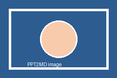

<!-- PPTX_PRESENTATION_META_START
{"slide_width": 12191999, "slide_height": 6858000}
PPTX_PRESENTATION_META_END -->

---

## Slide 1

**H1 Calibri 28**

Inline formula: $E=mc^2$
Block formula: $$\int_0^1 x^2 dx=\frac{1}{3}$$

*H2 Times New Roman 20*

**Bold** *Italic* <u>Underline</u> ~~Deleted~~ Normal

E=mc^2  H_2O

Rotated text box

Vertical Text

- Unordered item
  - Nested unordered item
1. Ordered item
   1. Ordered nested item
      - Deep nested item

<!-- PPTX_META_START
{
  "slide_num": 1,
  "shapes": [
    {
      "name": "TextBox 1",
      "type": "TEXT_BOX (17)",
      "raw_xml": "<p:sp xmlns:p=\"http://schemas.openxmlformats.org/presentationml/2006/main\" xmlns:a=\"http://schemas.openxmlformats.org/drawingml/2006/main\" xmlns:r=\"http://schemas.openxmlformats.org/officeDocument/2006/relationships\"><p:nvSpPr><p:cNvPr id=\"2\" name=\"TextBox 1\"/><p:cNvSpPr txBox=\"1\"/><p:nvPr/></p:nvSpPr><p:spPr><a:xfrm><a:off x=\"457200\" y=\"274320\"/><a:ext cx=\"5394960\" cy=\"502920\"/></a:xfrm><a:prstGeom prst=\"rect\"><a:avLst/></a:prstGeom><a:noFill/></p:spPr><p:txBody><a:bodyPr wrap=\"none\"><a:spAutoFit/></a:bodyPr><a:lstStyle/><a:p><a:r><a:rPr sz=\"2800\" b=\"1\"><a:solidFill><a:srgbClr val=\"1F4E79\"/></a:solidFill><a:latin typeface=\"Calibri\"/></a:rPr><a:t>H1 Calibri 28</a:t></a:r></a:p></p:txBody></p:sp>",
      "position": {
        "x": 457200,
        "y": 274320
      },
      "size": {
        "width": 5394960,
        "height": 502920
      },
      "rotation": 0,
      "fill": {
        "type": "none",
        "xml": "<a:noFill xmlns:a=\"http://schemas.openxmlformats.org/drawingml/2006/main\" xmlns:p=\"http://schemas.openxmlformats.org/presentationml/2006/main\" xmlns:r=\"http://schemas.openxmlformats.org/officeDocument/2006/relationships\"/>"
      },
      "body_props": {
        "wrap": "none",
        "autofit": "spAutoFit"
      },
      "text": {
        "paragraphs": [
          {
            "level": 0,
            "alignment": null,
            "runs": [
              {
                "text": "H1 Calibri 28",
                "font_size": 355600,
                "bold": true,
                "font_name": "Calibri",
                "font_color": "1F4E79"
              }
            ]
          }
        ]
      }
    },
    {
      "name": "TextBox 2",
      "type": "TEXT_BOX (17)",
      "raw_xml": "<p:sp xmlns:p=\"http://schemas.openxmlformats.org/presentationml/2006/main\" xmlns:a=\"http://schemas.openxmlformats.org/drawingml/2006/main\" xmlns:r=\"http://schemas.openxmlformats.org/officeDocument/2006/relationships\"><p:nvSpPr><p:cNvPr id=\"3\" name=\"TextBox 2\"/><p:cNvSpPr txBox=\"1\"/><p:nvPr/></p:nvSpPr><p:spPr><a:xfrm><a:off x=\"457200\" y=\"868680\"/><a:ext cx=\"5394960\" cy=\"411480\"/></a:xfrm><a:prstGeom prst=\"rect\"><a:avLst/></a:prstGeom><a:noFill/></p:spPr><p:txBody><a:bodyPr wrap=\"none\"><a:spAutoFit/></a:bodyPr><a:lstStyle/><a:p><a:r><a:rPr sz=\"2000\" i=\"1\"><a:solidFill><a:srgbClr val=\"7030A0\"/></a:solidFill><a:latin typeface=\"Times New Roman\"/></a:rPr><a:t>H2 Times New Roman 20</a:t></a:r></a:p></p:txBody></p:sp>",
      "position": {
        "x": 457200,
        "y": 868680
      },
      "size": {
        "width": 5394960,
        "height": 411480
      },
      "rotation": 0,
      "fill": {
        "type": "none",
        "xml": "<a:noFill xmlns:a=\"http://schemas.openxmlformats.org/drawingml/2006/main\" xmlns:p=\"http://schemas.openxmlformats.org/presentationml/2006/main\" xmlns:r=\"http://schemas.openxmlformats.org/officeDocument/2006/relationships\"/>"
      },
      "body_props": {
        "wrap": "none",
        "autofit": "spAutoFit"
      },
      "text": {
        "paragraphs": [
          {
            "level": 0,
            "alignment": null,
            "runs": [
              {
                "text": "H2 Times New Roman 20",
                "font_size": 254000,
                "italic": true,
                "font_name": "Times New Roman",
                "font_color": "7030A0"
              }
            ]
          }
        ]
      }
    },
    {
      "name": "TextBox 3",
      "type": "TEXT_BOX (17)",
      "raw_xml": "<p:sp xmlns:p=\"http://schemas.openxmlformats.org/presentationml/2006/main\" xmlns:a=\"http://schemas.openxmlformats.org/drawingml/2006/main\" xmlns:r=\"http://schemas.openxmlformats.org/officeDocument/2006/relationships\"><p:nvSpPr><p:cNvPr id=\"4\" name=\"TextBox 3\"/><p:cNvSpPr txBox=\"1\"/><p:nvPr/></p:nvSpPr><p:spPr><a:xfrm><a:off x=\"457200\" y=\"1417320\"/><a:ext cx=\"5669280\" cy=\"914400\"/></a:xfrm><a:prstGeom prst=\"rect\"><a:avLst/></a:prstGeom><a:noFill/></p:spPr><p:txBody><a:bodyPr wrap=\"none\"><a:spAutoFit/></a:bodyPr><a:lstStyle/><a:p><a:r><a:rPr sz=\"1800\" b=\"1\"/><a:t>Bold </a:t></a:r><a:r><a:rPr sz=\"1800\" i=\"1\"/><a:t>Italic </a:t></a:r><a:r><a:rPr sz=\"1800\" u=\"sng\"/><a:t>Underline </a:t></a:r><a:r><a:rPr sz=\"1800\" strike=\"sngStrike\"/><a:t>Deleted </a:t></a:r><a:r><a:rPr sz=\"1800\"/><a:t>Normal</a:t></a:r></a:p></p:txBody></p:sp>",
      "position": {
        "x": 457200,
        "y": 1417320
      },
      "size": {
        "width": 5669280,
        "height": 914400
      },
      "rotation": 0,
      "fill": {
        "type": "none",
        "xml": "<a:noFill xmlns:a=\"http://schemas.openxmlformats.org/drawingml/2006/main\" xmlns:p=\"http://schemas.openxmlformats.org/presentationml/2006/main\" xmlns:r=\"http://schemas.openxmlformats.org/officeDocument/2006/relationships\"/>"
      },
      "body_props": {
        "wrap": "none",
        "autofit": "spAutoFit"
      },
      "text": {
        "paragraphs": [
          {
            "level": 0,
            "alignment": null,
            "runs": [
              {
                "text": "Bold ",
                "font_size": 228600,
                "bold": true
              },
              {
                "text": "Italic ",
                "font_size": 228600,
                "italic": true
              },
              {
                "text": "Underline ",
                "font_size": 228600,
                "underline": true
              },
              {
                "text": "Deleted ",
                "font_size": 228600,
                "strikethrough": true
              },
              {
                "text": "Normal",
                "font_size": 228600
              }
            ]
          }
        ]
      }
    },
    {
      "name": "TextBox 4",
      "type": "TEXT_BOX (17)",
      "raw_xml": "<p:sp xmlns:p=\"http://schemas.openxmlformats.org/presentationml/2006/main\" xmlns:a=\"http://schemas.openxmlformats.org/drawingml/2006/main\" xmlns:r=\"http://schemas.openxmlformats.org/officeDocument/2006/relationships\"><p:nvSpPr><p:cNvPr id=\"5\" name=\"TextBox 4\"/><p:cNvSpPr txBox=\"1\"/><p:nvPr/></p:nvSpPr><p:spPr><a:xfrm><a:off x=\"6400800\" y=\"457200\"/><a:ext cx=\"4937760\" cy=\"1051560\"/></a:xfrm><a:prstGeom prst=\"rect\"><a:avLst/></a:prstGeom><a:noFill/></p:spPr><p:txBody><a:bodyPr wrap=\"none\"><a:spAutoFit/></a:bodyPr><a:lstStyle/><a:p><a:r><a:rPr sz=\"1700\"><a:latin typeface=\"Cambria Math\"/></a:rPr><a:t>Inline formula: $E=mc^2$</a:t></a:r></a:p><a:p><a:r><a:rPr sz=\"1700\"><a:latin typeface=\"Cambria Math\"/></a:rPr><a:t>Block formula: $$\\int_0^1 x^2 dx=\\frac{1}{3}$$</a:t></a:r></a:p></p:txBody></p:sp>",
      "position": {
        "x": 6400800,
        "y": 457200
      },
      "size": {
        "width": 4937760,
        "height": 1051560
      },
      "rotation": 0,
      "fill": {
        "type": "none",
        "xml": "<a:noFill xmlns:a=\"http://schemas.openxmlformats.org/drawingml/2006/main\" xmlns:p=\"http://schemas.openxmlformats.org/presentationml/2006/main\" xmlns:r=\"http://schemas.openxmlformats.org/officeDocument/2006/relationships\"/>"
      },
      "body_props": {
        "wrap": "none",
        "autofit": "spAutoFit"
      },
      "text": {
        "paragraphs": [
          {
            "level": 0,
            "alignment": null,
            "runs": [
              {
                "text": "Inline formula: $E=mc^2$",
                "font_size": 215900,
                "font_name": "Cambria Math"
              }
            ]
          },
          {
            "level": 0,
            "alignment": null,
            "runs": [
              {
                "text": "Block formula: $$\\int_0^1 x^2 dx=\\frac{1}{3}$$",
                "font_size": 215900,
                "font_name": "Cambria Math"
              }
            ]
          }
        ]
      }
    },
    {
      "name": "TextBox 5",
      "type": "TEXT_BOX (17)",
      "raw_xml": "<p:sp xmlns:p=\"http://schemas.openxmlformats.org/presentationml/2006/main\" xmlns:a=\"http://schemas.openxmlformats.org/drawingml/2006/main\" xmlns:r=\"http://schemas.openxmlformats.org/officeDocument/2006/relationships\"><p:nvSpPr><p:cNvPr id=\"6\" name=\"TextBox 5\"/><p:cNvSpPr txBox=\"1\"/><p:nvPr/></p:nvSpPr><p:spPr><a:xfrm><a:off x=\"6400800\" y=\"1645920\"/><a:ext cx=\"3840480\" cy=\"548640\"/></a:xfrm><a:prstGeom prst=\"rect\"><a:avLst/></a:prstGeom><a:noFill/></p:spPr><p:txBody><a:bodyPr wrap=\"none\"><a:spAutoFit/></a:bodyPr><a:lstStyle/><a:p><a:r><a:rPr sz=\"2000\"/><a:t>E=mc</a:t></a:r><a:r><a:rPr sz=\"2000\" baseline=\"30000\"/><a:t>2</a:t></a:r><a:r><a:rPr sz=\"2000\"/><a:t>  H</a:t></a:r><a:r><a:rPr sz=\"2000\" baseline=\"-25000\"/><a:t>2</a:t></a:r><a:r><a:rPr sz=\"2000\"/><a:t>O</a:t></a:r></a:p></p:txBody></p:sp>",
      "position": {
        "x": 6400800,
        "y": 1645920
      },
      "size": {
        "width": 3840480,
        "height": 548640
      },
      "rotation": 0,
      "fill": {
        "type": "none",
        "xml": "<a:noFill xmlns:a=\"http://schemas.openxmlformats.org/drawingml/2006/main\" xmlns:p=\"http://schemas.openxmlformats.org/presentationml/2006/main\" xmlns:r=\"http://schemas.openxmlformats.org/officeDocument/2006/relationships\"/>"
      },
      "body_props": {
        "wrap": "none",
        "autofit": "spAutoFit"
      },
      "text": {
        "paragraphs": [
          {
            "level": 0,
            "alignment": null,
            "runs": [
              {
                "text": "E=mc",
                "font_size": 254000
              },
              {
                "text": "2",
                "font_size": 254000,
                "superscript": true
              },
              {
                "text": "  H",
                "font_size": 254000
              },
              {
                "text": "2",
                "font_size": 254000,
                "subscript": true
              },
              {
                "text": "O",
                "font_size": 254000
              }
            ]
          }
        ]
      }
    },
    {
      "name": "TextBox 6",
      "type": "TEXT_BOX (17)",
      "raw_xml": "<p:sp xmlns:p=\"http://schemas.openxmlformats.org/presentationml/2006/main\" xmlns:a=\"http://schemas.openxmlformats.org/drawingml/2006/main\" xmlns:r=\"http://schemas.openxmlformats.org/officeDocument/2006/relationships\"><p:nvSpPr><p:cNvPr id=\"7\" name=\"TextBox 6\"/><p:cNvSpPr txBox=\"1\"/><p:nvPr/></p:nvSpPr><p:spPr><a:xfrm><a:off x=\"548640\" y=\"2560320\"/><a:ext cx=\"5212080\" cy=\"1828800\"/></a:xfrm><a:prstGeom prst=\"rect\"><a:avLst/></a:prstGeom><a:noFill/></p:spPr><p:txBody><a:bodyPr wrap=\"none\"><a:spAutoFit/></a:bodyPr><a:lstStyle/><a:p><a:pPr/><a:r><a:t>Unordered item</a:t></a:r></a:p><a:p><a:pPr lvl=\"1\"/><a:r><a:rPr sz=\"1600\"/><a:t>Nested unordered item</a:t></a:r></a:p><a:p><a:pPr/><a:r><a:rPr sz=\"1600\"/><a:t>1. Ordered item</a:t></a:r></a:p><a:p><a:pPr lvl=\"1\"/><a:r><a:rPr sz=\"1600\"/><a:t>1.1 Ordered nested item</a:t></a:r></a:p><a:p><a:pPr lvl=\"2\"/><a:r><a:rPr sz=\"1600\"/><a:t>Deep nested item</a:t></a:r></a:p></p:txBody></p:sp>",
      "position": {
        "x": 548640,
        "y": 2560320
      },
      "size": {
        "width": 5212080,
        "height": 1828800
      },
      "rotation": 0,
      "fill": {
        "type": "none",
        "xml": "<a:noFill xmlns:a=\"http://schemas.openxmlformats.org/drawingml/2006/main\" xmlns:p=\"http://schemas.openxmlformats.org/presentationml/2006/main\" xmlns:r=\"http://schemas.openxmlformats.org/officeDocument/2006/relationships\"/>"
      },
      "body_props": {
        "wrap": "none",
        "autofit": "spAutoFit"
      },
      "text": {
        "paragraphs": [
          {
            "level": 0,
            "alignment": null,
            "runs": [
              {
                "text": "Unordered item"
              }
            ]
          },
          {
            "level": 1,
            "alignment": null,
            "runs": [
              {
                "text": "Nested unordered item",
                "font_size": 203200
              }
            ]
          },
          {
            "level": 0,
            "alignment": null,
            "runs": [
              {
                "text": "1. Ordered item",
                "font_size": 203200
              }
            ]
          },
          {
            "level": 1,
            "alignment": null,
            "runs": [
              {
                "text": "1.1 Ordered nested item",
                "font_size": 203200
              }
            ]
          },
          {
            "level": 2,
            "alignment": null,
            "runs": [
              {
                "text": "Deep nested item",
                "font_size": 203200
              }
            ]
          }
        ]
      }
    },
    {
      "name": "TextBox 7",
      "type": "TEXT_BOX (17)",
      "raw_xml": "<p:sp xmlns:p=\"http://schemas.openxmlformats.org/presentationml/2006/main\" xmlns:a=\"http://schemas.openxmlformats.org/drawingml/2006/main\" xmlns:r=\"http://schemas.openxmlformats.org/officeDocument/2006/relationships\"><p:nvSpPr><p:cNvPr id=\"8\" name=\"TextBox 7\"/><p:cNvSpPr txBox=\"1\"/><p:nvPr/></p:nvSpPr><p:spPr><a:xfrm rot=\"1680000\"><a:off x=\"6537960\" y=\"2514600\"/><a:ext cx=\"2194560\" cy=\"548640\"/></a:xfrm><a:prstGeom prst=\"rect\"><a:avLst/></a:prstGeom><a:noFill/></p:spPr><p:txBody><a:bodyPr wrap=\"none\"><a:spAutoFit/></a:bodyPr><a:lstStyle/><a:p><a:pPr algn=\"ctr\"/><a:r><a:t>Rotated text box</a:t></a:r></a:p></p:txBody></p:sp>",
      "position": {
        "x": 6537960,
        "y": 2514600
      },
      "size": {
        "width": 2194560,
        "height": 548640
      },
      "rotation": 28.0,
      "fill": {
        "type": "none",
        "xml": "<a:noFill xmlns:a=\"http://schemas.openxmlformats.org/drawingml/2006/main\" xmlns:p=\"http://schemas.openxmlformats.org/presentationml/2006/main\" xmlns:r=\"http://schemas.openxmlformats.org/officeDocument/2006/relationships\"/>"
      },
      "body_props": {
        "wrap": "none",
        "autofit": "spAutoFit"
      },
      "text": {
        "paragraphs": [
          {
            "level": 0,
            "alignment": "CENTER (2)",
            "runs": [
              {
                "text": "Rotated text box"
              }
            ]
          }
        ]
      }
    },
    {
      "name": "TextBox 8",
      "type": "TEXT_BOX (17)",
      "raw_xml": "<p:sp xmlns:p=\"http://schemas.openxmlformats.org/presentationml/2006/main\" xmlns:a=\"http://schemas.openxmlformats.org/drawingml/2006/main\" xmlns:r=\"http://schemas.openxmlformats.org/officeDocument/2006/relationships\"><p:nvSpPr><p:cNvPr id=\"9\" name=\"TextBox 8\"/><p:cNvSpPr txBox=\"1\"/><p:nvPr/></p:nvSpPr><p:spPr><a:xfrm><a:off x=\"9692640\" y=\"2468880\"/><a:ext cx=\"594360\" cy=\"2103120\"/></a:xfrm><a:prstGeom prst=\"rect\"><a:avLst/></a:prstGeom><a:noFill/></p:spPr><p:txBody><a:bodyPr wrap=\"none\" vert=\"vert270\"><a:spAutoFit/></a:bodyPr><a:lstStyle/><a:p><a:r><a:t>Vertical Text</a:t></a:r></a:p></p:txBody></p:sp>",
      "position": {
        "x": 9692640,
        "y": 2468880
      },
      "size": {
        "width": 594360,
        "height": 2103120
      },
      "rotation": 0,
      "fill": {
        "type": "none",
        "xml": "<a:noFill xmlns:a=\"http://schemas.openxmlformats.org/drawingml/2006/main\" xmlns:p=\"http://schemas.openxmlformats.org/presentationml/2006/main\" xmlns:r=\"http://schemas.openxmlformats.org/officeDocument/2006/relationships\"/>"
      },
      "body_props": {
        "wrap": "none",
        "vert": "vert270",
        "autofit": "spAutoFit"
      },
      "text": {
        "paragraphs": [
          {
            "level": 0,
            "alignment": null,
            "runs": [
              {
                "text": "Vertical Text"
              }
            ]
          }
        ]
      }
    }
  ],
  "_theme_xml": "<?xml version=\"1.0\" encoding=\"UTF-8\" standalone=\"yes\"?>\r\n<a:theme xmlns:a=\"http://schemas.openxmlformats.org/drawingml/2006/main\" name=\"Office Theme\"><a:themeElements><a:clrScheme name=\"Office\"><a:dk1><a:sysClr val=\"windowText\" lastClr=\"000000\"/></a:dk1><a:lt1><a:sysClr val=\"window\" lastClr=\"FFFFFF\"/></a:lt1><a:dk2><a:srgbClr val=\"1F497D\"/></a:dk2><a:lt2><a:srgbClr val=\"EEECE1\"/></a:lt2><a:accent1><a:srgbClr val=\"4F81BD\"/></a:accent1><a:accent2><a:srgbClr val=\"C0504D\"/></a:accent2><a:accent3><a:srgbClr val=\"9BBB59\"/></a:accent3><a:accent4><a:srgbClr val=\"8064A2\"/></a:accent4><a:accent5><a:srgbClr val=\"4BACC6\"/></a:accent5><a:accent6><a:srgbClr val=\"F79646\"/></a:accent6><a:hlink><a:srgbClr val=\"0000FF\"/></a:hlink><a:folHlink><a:srgbClr val=\"800080\"/></a:folHlink></a:clrScheme><a:fontScheme name=\"Office\"><a:majorFont><a:latin typeface=\"Calibri\"/><a:ea typeface=\"\"/><a:cs typeface=\"\"/><a:font script=\"Jpan\" typeface=\"ＭＳ Ｐゴシック\"/><a:font script=\"Hang\" typeface=\"맑은 고딕\"/><a:font script=\"Hans\" typeface=\"宋体\"/><a:font script=\"Hant\" typeface=\"新細明體\"/><a:font script=\"Arab\" typeface=\"Times New Roman\"/><a:font script=\"Hebr\" typeface=\"Times New Roman\"/><a:font script=\"Thai\" typeface=\"Angsana New\"/><a:font script=\"Ethi\" typeface=\"Nyala\"/><a:font script=\"Beng\" typeface=\"Vrinda\"/><a:font script=\"Gujr\" typeface=\"Shruti\"/><a:font script=\"Khmr\" typeface=\"MoolBoran\"/><a:font script=\"Knda\" typeface=\"Tunga\"/><a:font script=\"Guru\" typeface=\"Raavi\"/><a:font script=\"Cans\" typeface=\"Euphemia\"/><a:font script=\"Cher\" typeface=\"Plantagenet Cherokee\"/><a:font script=\"Yiii\" typeface=\"Microsoft Yi Baiti\"/><a:font script=\"Tibt\" typeface=\"Microsoft Himalaya\"/><a:font script=\"Thaa\" typeface=\"MV Boli\"/><a:font script=\"Deva\" typeface=\"Mangal\"/><a:font script=\"Telu\" typeface=\"Gautami\"/><a:font script=\"Taml\" typeface=\"Latha\"/><a:font script=\"Syrc\" typeface=\"Estrangelo Edessa\"/><a:font script=\"Orya\" typeface=\"Kalinga\"/><a:font script=\"Mlym\" typeface=\"Kartika\"/><a:font script=\"Laoo\" typeface=\"DokChampa\"/><a:font script=\"Sinh\" typeface=\"Iskoola Pota\"/><a:font script=\"Mong\" typeface=\"Mongolian Baiti\"/><a:font script=\"Viet\" typeface=\"Times New Roman\"/><a:font script=\"Uigh\" typeface=\"Microsoft Uighur\"/><a:font script=\"Geor\" typeface=\"Sylfaen\"/></a:majorFont><a:minorFont><a:latin typeface=\"Calibri\"/><a:ea typeface=\"\"/><a:cs typeface=\"\"/><a:font script=\"Jpan\" typeface=\"ＭＳ Ｐゴシック\"/><a:font script=\"Hang\" typeface=\"맑은 고딕\"/><a:font script=\"Hans\" typeface=\"宋体\"/><a:font script=\"Hant\" typeface=\"新細明體\"/><a:font script=\"Arab\" typeface=\"Arial\"/><a:font script=\"Hebr\" typeface=\"Arial\"/><a:font script=\"Thai\" typeface=\"Cordia New\"/><a:font script=\"Ethi\" typeface=\"Nyala\"/><a:font script=\"Beng\" typeface=\"Vrinda\"/><a:font script=\"Gujr\" typeface=\"Shruti\"/><a:font script=\"Khmr\" typeface=\"DaunPenh\"/><a:font script=\"Knda\" typeface=\"Tunga\"/><a:font script=\"Guru\" typeface=\"Raavi\"/><a:font script=\"Cans\" typeface=\"Euphemia\"/><a:font script=\"Cher\" typeface=\"Plantagenet Cherokee\"/><a:font script=\"Yiii\" typeface=\"Microsoft Yi Baiti\"/><a:font script=\"Tibt\" typeface=\"Microsoft Himalaya\"/><a:font script=\"Thaa\" typeface=\"MV Boli\"/><a:font script=\"Deva\" typeface=\"Mangal\"/><a:font script=\"Telu\" typeface=\"Gautami\"/><a:font script=\"Taml\" typeface=\"Latha\"/><a:font script=\"Syrc\" typeface=\"Estrangelo Edessa\"/><a:font script=\"Orya\" typeface=\"Kalinga\"/><a:font script=\"Mlym\" typeface=\"Kartika\"/><a:font script=\"Laoo\" typeface=\"DokChampa\"/><a:font script=\"Sinh\" typeface=\"Iskoola Pota\"/><a:font script=\"Mong\" typeface=\"Mongolian Baiti\"/><a:font script=\"Viet\" typeface=\"Arial\"/><a:font script=\"Uigh\" typeface=\"Microsoft Uighur\"/><a:font script=\"Geor\" typeface=\"Sylfaen\"/></a:minorFont></a:fontScheme><a:fmtScheme name=\"Office\"><a:fillStyleLst><a:solidFill><a:schemeClr val=\"phClr\"/></a:solidFill><a:gradFill rotWithShape=\"1\"><a:gsLst><a:gs pos=\"0\"><a:schemeClr val=\"phClr\"><a:tint val=\"50000\"/><a:satMod val=\"300000\"/></a:schemeClr></a:gs><a:gs pos=\"35000\"><a:schemeClr val=\"phClr\"><a:tint val=\"37000\"/><a:satMod val=\"300000\"/></a:schemeClr></a:gs><a:gs pos=\"100000\"><a:schemeClr val=\"phClr\"><a:tint val=\"15000\"/><a:satMod val=\"350000\"/></a:schemeClr></a:gs></a:gsLst><a:lin ang=\"16200000\" scaled=\"1\"/></a:gradFill><a:gradFill rotWithShape=\"1\"><a:gsLst><a:gs pos=\"0\"><a:schemeClr val=\"phClr\"><a:tint val=\"100000\"/><a:shade val=\"100000\"/><a:satMod val=\"130000\"/></a:schemeClr></a:gs><a:gs pos=\"100000\"><a:schemeClr val=\"phClr\"><a:tint val=\"50000\"/><a:shade val=\"100000\"/><a:satMod val=\"350000\"/></a:schemeClr></a:gs></a:gsLst><a:lin ang=\"16200000\" scaled=\"0\"/></a:gradFill></a:fillStyleLst><a:lnStyleLst><a:ln w=\"9525\" cap=\"flat\" cmpd=\"sng\" algn=\"ctr\"><a:solidFill><a:schemeClr val=\"phClr\"><a:shade val=\"95000\"/><a:satMod val=\"105000\"/></a:schemeClr></a:solidFill><a:prstDash val=\"solid\"/></a:ln><a:ln w=\"25400\" cap=\"flat\" cmpd=\"sng\" algn=\"ctr\"><a:solidFill><a:schemeClr val=\"phClr\"/></a:solidFill><a:prstDash val=\"solid\"/></a:ln><a:ln w=\"38100\" cap=\"flat\" cmpd=\"sng\" algn=\"ctr\"><a:solidFill><a:schemeClr val=\"phClr\"/></a:solidFill><a:prstDash val=\"solid\"/></a:ln></a:lnStyleLst><a:effectStyleLst><a:effectStyle><a:effectLst><a:outerShdw blurRad=\"40000\" dist=\"20000\" dir=\"5400000\" rotWithShape=\"0\"><a:srgbClr val=\"000000\"><a:alpha val=\"38000\"/></a:srgbClr></a:outerShdw></a:effectLst></a:effectStyle><a:effectStyle><a:effectLst><a:outerShdw blurRad=\"40000\" dist=\"23000\" dir=\"5400000\" rotWithShape=\"0\"><a:srgbClr val=\"000000\"><a:alpha val=\"35000\"/></a:srgbClr></a:outerShdw></a:effectLst></a:effectStyle><a:effectStyle><a:effectLst><a:outerShdw blurRad=\"40000\" dist=\"23000\" dir=\"5400000\" rotWithShape=\"0\"><a:srgbClr val=\"000000\"><a:alpha val=\"35000\"/></a:srgbClr></a:outerShdw></a:effectLst><a:scene3d><a:camera prst=\"orthographicFront\"><a:rot lat=\"0\" lon=\"0\" rev=\"0\"/></a:camera><a:lightRig rig=\"threePt\" dir=\"t\"><a:rot lat=\"0\" lon=\"0\" rev=\"1200000\"/></a:lightRig></a:scene3d><a:sp3d><a:bevelT w=\"63500\" h=\"25400\"/></a:sp3d></a:effectStyle></a:effectStyleLst><a:bgFillStyleLst><a:solidFill><a:schemeClr val=\"phClr\"/></a:solidFill><a:gradFill rotWithShape=\"1\"><a:gsLst><a:gs pos=\"0\"><a:schemeClr val=\"phClr\"><a:tint val=\"40000\"/><a:satMod val=\"350000\"/></a:schemeClr></a:gs><a:gs pos=\"40000\"><a:schemeClr val=\"phClr\"><a:tint val=\"45000\"/><a:shade val=\"99000\"/><a:satMod val=\"350000\"/></a:schemeClr></a:gs><a:gs pos=\"100000\"><a:schemeClr val=\"phClr\"><a:shade val=\"20000\"/><a:satMod val=\"255000\"/></a:schemeClr></a:gs></a:gsLst><a:path path=\"circle\"><a:fillToRect l=\"50000\" t=\"-80000\" r=\"50000\" b=\"180000\"/></a:path></a:gradFill><a:gradFill rotWithShape=\"1\"><a:gsLst><a:gs pos=\"0\"><a:schemeClr val=\"phClr\"><a:tint val=\"80000\"/><a:satMod val=\"300000\"/></a:schemeClr></a:gs><a:gs pos=\"100000\"><a:schemeClr val=\"phClr\"><a:shade val=\"30000\"/><a:satMod val=\"200000\"/></a:schemeClr></a:gs></a:gsLst><a:path path=\"circle\"><a:fillToRect l=\"50000\" t=\"50000\" r=\"50000\" b=\"50000\"/></a:path></a:gradFill></a:bgFillStyleLst></a:fmtScheme></a:themeElements><a:objectDefaults><a:spDef><a:spPr/><a:bodyPr/><a:lstStyle/><a:style><a:lnRef idx=\"1\"><a:schemeClr val=\"accent1\"/></a:lnRef><a:fillRef idx=\"3\"><a:schemeClr val=\"accent1\"/></a:fillRef><a:effectRef idx=\"2\"><a:schemeClr val=\"accent1\"/></a:effectRef><a:fontRef idx=\"minor\"><a:schemeClr val=\"lt1\"/></a:fontRef></a:style></a:spDef><a:lnDef><a:spPr/><a:bodyPr/><a:lstStyle/><a:style><a:lnRef idx=\"2\"><a:schemeClr val=\"accent1\"/></a:lnRef><a:fillRef idx=\"0\"><a:schemeClr val=\"accent1\"/></a:fillRef><a:effectRef idx=\"1\"><a:schemeClr val=\"accent1\"/></a:effectRef><a:fontRef idx=\"minor\"><a:schemeClr val=\"tx1\"/></a:fontRef></a:style></a:lnDef></a:objectDefaults><a:extraClrSchemeLst/></a:theme>"
}
PPTX_META_END -->

<!-- Notes -->
### Speaker Notes

Speaker notes: verify notes are preserved in roundtrip metadata.

---

## Slide 2

**Shapes, tables, images, fills, and groups**

<!-- position: x=1.52cm, y=2.41cm, width=5.59cm, height=3.68cm -->

<!-- position: x=7.62cm, y=2.41cm, width=3.17cm, height=2.16cm -->

Solid fill

Dashed border

No fill

Gradient

Trapezoid

| Merged header |  |  |  |
| --- | --- | --- | --- |
| Feature | Left | Center | Right |
| Bold | A | B | C |
| Formula | $x$ | $y$ | $z$ |

Grouped
Pair

<!-- PPTX_META_START
{
  "slide_num": 2,
  "shapes": [
    {
      "name": "TextBox 1",
      "type": "TEXT_BOX (17)",
      "raw_xml": "<p:sp xmlns:p=\"http://schemas.openxmlformats.org/presentationml/2006/main\" xmlns:a=\"http://schemas.openxmlformats.org/drawingml/2006/main\" xmlns:r=\"http://schemas.openxmlformats.org/officeDocument/2006/relationships\"><p:nvSpPr><p:cNvPr id=\"2\" name=\"TextBox 1\"/><p:cNvSpPr txBox=\"1\"/><p:nvPr/></p:nvSpPr><p:spPr><a:xfrm><a:off x=\"457200\" y=\"228600\"/><a:ext cx=\"4572000\" cy=\"411480\"/></a:xfrm><a:prstGeom prst=\"rect\"><a:avLst/></a:prstGeom><a:noFill/></p:spPr><p:txBody><a:bodyPr wrap=\"none\"><a:spAutoFit/></a:bodyPr><a:lstStyle/><a:p><a:r><a:rPr sz=\"2200\" b=\"1\"/><a:t>Shapes, tables, images, fills, and groups</a:t></a:r></a:p></p:txBody></p:sp>",
      "position": {
        "x": 457200,
        "y": 228600
      },
      "size": {
        "width": 4572000,
        "height": 411480
      },
      "rotation": 0,
      "fill": {
        "type": "none",
        "xml": "<a:noFill xmlns:a=\"http://schemas.openxmlformats.org/drawingml/2006/main\" xmlns:p=\"http://schemas.openxmlformats.org/presentationml/2006/main\" xmlns:r=\"http://schemas.openxmlformats.org/officeDocument/2006/relationships\"/>"
      },
      "body_props": {
        "wrap": "none",
        "autofit": "spAutoFit"
      },
      "text": {
        "paragraphs": [
          {
            "level": 0,
            "alignment": null,
            "runs": [
              {
                "text": "Shapes, tables, images, fills, and groups",
                "font_size": 279400,
                "bold": true
              }
            ]
          }
        ]
      }
    },
    {
      "name": "Picture 2",
      "type": "PICTURE (13)",
      "raw_xml": "<p:pic xmlns:p=\"http://schemas.openxmlformats.org/presentationml/2006/main\" xmlns:a=\"http://schemas.openxmlformats.org/drawingml/2006/main\" xmlns:r=\"http://schemas.openxmlformats.org/officeDocument/2006/relationships\"><p:nvPicPr><p:cNvPr id=\"3\" name=\"Picture 2\" descr=\"all_features_source_image.png\"/><p:cNvPicPr><a:picLocks noChangeAspect=\"1\"/></p:cNvPicPr><p:nvPr/></p:nvPicPr><p:blipFill><a:blip r:embed=\"rId2\"/><a:stretch><a:fillRect/></a:stretch></p:blipFill><p:spPr><a:xfrm><a:off x=\"548640\" y=\"868680\"/><a:ext cx=\"2011680\" cy=\"1325880\"/></a:xfrm><a:prstGeom prst=\"rect\"><a:avLst/></a:prstGeom></p:spPr></p:pic>",
      "position": {
        "x": 548640,
        "y": 868680
      },
      "size": {
        "width": 2011680,
        "height": 1325880
      },
      "rotation": 0,
      "raw_relationships": {
        "rId2": {
          "type": "image",
          "filename": "slide_02_img_01.png"
        }
      },
      "image": {
        "content_type": "image/png",
        "blob_size": 2132,
        "filename": "slide_02_img_01.png"
      }
    },
    {
      "name": "Picture 3",
      "type": "PICTURE (13)",
      "raw_xml": "<p:pic xmlns:p=\"http://schemas.openxmlformats.org/presentationml/2006/main\" xmlns:a=\"http://schemas.openxmlformats.org/drawingml/2006/main\" xmlns:r=\"http://schemas.openxmlformats.org/officeDocument/2006/relationships\"><p:nvPicPr><p:cNvPr id=\"4\" name=\"Picture 3\" descr=\"all_features_source_image.png\"/><p:cNvPicPr><a:picLocks noChangeAspect=\"1\"/></p:cNvPicPr><p:nvPr/></p:nvPicPr><p:blipFill><a:blip r:embed=\"rId2\"/><a:stretch><a:fillRect/></a:stretch></p:blipFill><p:spPr><a:xfrm><a:off x=\"2743200\" y=\"868680\"/><a:ext cx=\"1143000\" cy=\"777240\"/></a:xfrm><a:prstGeom prst=\"rect\"><a:avLst/></a:prstGeom></p:spPr></p:pic>",
      "position": {
        "x": 2743200,
        "y": 868680
      },
      "size": {
        "width": 1143000,
        "height": 777240
      },
      "rotation": 0,
      "raw_relationships": {
        "rId2": {
          "type": "image",
          "filename": "slide_02_img_01.png"
        }
      },
      "image": {
        "content_type": "image/png",
        "blob_size": 2132,
        "filename": "slide_02_img_01.png"
      }
    },
    {
      "name": "Rectangle 4",
      "type": "AUTO_SHAPE (1)",
      "raw_xml": "<p:sp xmlns:p=\"http://schemas.openxmlformats.org/presentationml/2006/main\" xmlns:a=\"http://schemas.openxmlformats.org/drawingml/2006/main\" xmlns:r=\"http://schemas.openxmlformats.org/officeDocument/2006/relationships\"><p:nvSpPr><p:cNvPr id=\"5\" name=\"Rectangle 4\"/><p:cNvSpPr/><p:nvPr/></p:nvSpPr><p:spPr><a:xfrm><a:off x=\"4572000\" y=\"822960\"/><a:ext cx=\"1280160\" cy=\"731520\"/></a:xfrm><a:prstGeom prst=\"rect\"><a:avLst/></a:prstGeom><a:solidFill><a:srgbClr val=\"C6E0B4\"/></a:solidFill><a:ln w=\"25400\"><a:solidFill><a:srgbClr val=\"548235\"/></a:solidFill></a:ln></p:spPr><p:style><a:lnRef idx=\"1\"><a:schemeClr val=\"accent1\"/></a:lnRef><a:fillRef idx=\"3\"><a:schemeClr val=\"accent1\"/></a:fillRef><a:effectRef idx=\"2\"><a:schemeClr val=\"accent1\"/></a:effectRef><a:fontRef idx=\"minor\"><a:schemeClr val=\"lt1\"/></a:fontRef></p:style><p:txBody><a:bodyPr rtlCol=\"0\" anchor=\"ctr\"/><a:lstStyle/><a:p><a:r><a:t>Solid fill</a:t></a:r></a:p></p:txBody></p:sp>",
      "position": {
        "x": 4572000,
        "y": 822960
      },
      "size": {
        "width": 1280160,
        "height": 731520
      },
      "rotation": 0,
      "auto_shape_type": "RECTANGLE (1)",
      "fill": {
        "type": "solid",
        "color": "C6E0B4",
        "xml": "<a:solidFill xmlns:a=\"http://schemas.openxmlformats.org/drawingml/2006/main\" xmlns:p=\"http://schemas.openxmlformats.org/presentationml/2006/main\" xmlns:r=\"http://schemas.openxmlformats.org/officeDocument/2006/relationships\"><a:srgbClr val=\"C6E0B4\"/></a:solidFill>"
      },
      "line": {
        "width": 25400,
        "xml": "<a:ln xmlns:a=\"http://schemas.openxmlformats.org/drawingml/2006/main\" xmlns:p=\"http://schemas.openxmlformats.org/presentationml/2006/main\" xmlns:r=\"http://schemas.openxmlformats.org/officeDocument/2006/relationships\" w=\"25400\"><a:solidFill><a:srgbClr val=\"548235\"/></a:solidFill></a:ln>",
        "color": "548235",
        "connector_geom": "rect"
      },
      "body_props": {
        "anchor": "ctr",
        "rtlCol": "0"
      },
      "text": {
        "paragraphs": [
          {
            "level": 0,
            "alignment": null,
            "runs": [
              {
                "text": "Solid fill"
              }
            ]
          }
        ]
      }
    },
    {
      "name": "Rounded Rectangle 5",
      "type": "AUTO_SHAPE (1)",
      "raw_xml": "<p:sp xmlns:p=\"http://schemas.openxmlformats.org/presentationml/2006/main\" xmlns:a=\"http://schemas.openxmlformats.org/drawingml/2006/main\" xmlns:r=\"http://schemas.openxmlformats.org/officeDocument/2006/relationships\"><p:nvSpPr><p:cNvPr id=\"6\" name=\"Rounded Rectangle 5\"/><p:cNvSpPr/><p:nvPr/></p:nvSpPr><p:spPr><a:xfrm><a:off x=\"6172200\" y=\"822960\"/><a:ext cx=\"1554480\" cy=\"731520\"/></a:xfrm><a:prstGeom prst=\"roundRect\"><a:avLst/></a:prstGeom><a:solidFill><a:srgbClr val=\"F8CBAD\"/></a:solidFill><a:ln w=\"25400\"><a:solidFill><a:srgbClr val=\"C55A11\"/></a:solidFill><a:prstDash val=\"dash\"/></a:ln></p:spPr><p:style><a:lnRef idx=\"1\"><a:schemeClr val=\"accent1\"/></a:lnRef><a:fillRef idx=\"3\"><a:schemeClr val=\"accent1\"/></a:fillRef><a:effectRef idx=\"2\"><a:schemeClr val=\"accent1\"/></a:effectRef><a:fontRef idx=\"minor\"><a:schemeClr val=\"lt1\"/></a:fontRef></p:style><p:txBody><a:bodyPr rtlCol=\"0\" anchor=\"ctr\"/><a:lstStyle/><a:p><a:r><a:t>Dashed border</a:t></a:r></a:p></p:txBody></p:sp>",
      "position": {
        "x": 6172200,
        "y": 822960
      },
      "size": {
        "width": 1554480,
        "height": 731520
      },
      "rotation": 0,
      "auto_shape_type": "ROUNDED_RECTANGLE (5)",
      "fill": {
        "type": "solid",
        "color": "F8CBAD",
        "xml": "<a:solidFill xmlns:a=\"http://schemas.openxmlformats.org/drawingml/2006/main\" xmlns:p=\"http://schemas.openxmlformats.org/presentationml/2006/main\" xmlns:r=\"http://schemas.openxmlformats.org/officeDocument/2006/relationships\"><a:srgbClr val=\"F8CBAD\"/></a:solidFill>"
      },
      "line": {
        "width": 25400,
        "xml": "<a:ln xmlns:a=\"http://schemas.openxmlformats.org/drawingml/2006/main\" xmlns:p=\"http://schemas.openxmlformats.org/presentationml/2006/main\" xmlns:r=\"http://schemas.openxmlformats.org/officeDocument/2006/relationships\" w=\"25400\"><a:solidFill><a:srgbClr val=\"C55A11\"/></a:solidFill><a:prstDash val=\"dash\"/></a:ln>",
        "color": "C55A11",
        "dash": "dash",
        "connector_geom": "roundRect"
      },
      "body_props": {
        "anchor": "ctr",
        "rtlCol": "0"
      },
      "text": {
        "paragraphs": [
          {
            "level": 0,
            "alignment": null,
            "runs": [
              {
                "text": "Dashed border"
              }
            ]
          }
        ]
      }
    },
    {
      "name": "Oval 6",
      "type": "AUTO_SHAPE (1)",
      "raw_xml": "<p:sp xmlns:p=\"http://schemas.openxmlformats.org/presentationml/2006/main\" xmlns:a=\"http://schemas.openxmlformats.org/drawingml/2006/main\" xmlns:r=\"http://schemas.openxmlformats.org/officeDocument/2006/relationships\"><p:nvSpPr><p:cNvPr id=\"7\" name=\"Oval 6\"/><p:cNvSpPr/><p:nvPr/></p:nvSpPr><p:spPr><a:xfrm><a:off x=\"8092440\" y=\"777240\"/><a:ext cx=\"914400\" cy=\"914400\"/></a:xfrm><a:prstGeom prst=\"ellipse\"><a:avLst/></a:prstGeom><a:noFill/><a:ln w=\"25400\"><a:solidFill><a:srgbClr val=\"7030A0\"/></a:solidFill></a:ln></p:spPr><p:style><a:lnRef idx=\"1\"><a:schemeClr val=\"accent1\"/></a:lnRef><a:fillRef idx=\"3\"><a:schemeClr val=\"accent1\"/></a:fillRef><a:effectRef idx=\"2\"><a:schemeClr val=\"accent1\"/></a:effectRef><a:fontRef idx=\"minor\"><a:schemeClr val=\"lt1\"/></a:fontRef></p:style><p:txBody><a:bodyPr rtlCol=\"0\" anchor=\"ctr\"/><a:lstStyle/><a:p><a:r><a:t>No fill</a:t></a:r></a:p></p:txBody></p:sp>",
      "position": {
        "x": 8092440,
        "y": 777240
      },
      "size": {
        "width": 914400,
        "height": 914400
      },
      "rotation": 0,
      "auto_shape_type": "OVAL (9)",
      "fill": {
        "type": "none",
        "xml": "<a:noFill xmlns:a=\"http://schemas.openxmlformats.org/drawingml/2006/main\" xmlns:p=\"http://schemas.openxmlformats.org/presentationml/2006/main\" xmlns:r=\"http://schemas.openxmlformats.org/officeDocument/2006/relationships\"/>"
      },
      "line": {
        "width": 25400,
        "xml": "<a:ln xmlns:a=\"http://schemas.openxmlformats.org/drawingml/2006/main\" xmlns:p=\"http://schemas.openxmlformats.org/presentationml/2006/main\" xmlns:r=\"http://schemas.openxmlformats.org/officeDocument/2006/relationships\" w=\"25400\"><a:solidFill><a:srgbClr val=\"7030A0\"/></a:solidFill></a:ln>",
        "color": "7030A0",
        "connector_geom": "ellipse"
      },
      "body_props": {
        "anchor": "ctr",
        "rtlCol": "0"
      },
      "text": {
        "paragraphs": [
          {
            "level": 0,
            "alignment": null,
            "runs": [
              {
                "text": "No fill"
              }
            ]
          }
        ]
      }
    },
    {
      "name": "Rectangle 7",
      "type": "AUTO_SHAPE (1)",
      "raw_xml": "<p:sp xmlns:p=\"http://schemas.openxmlformats.org/presentationml/2006/main\" xmlns:a=\"http://schemas.openxmlformats.org/drawingml/2006/main\" xmlns:r=\"http://schemas.openxmlformats.org/officeDocument/2006/relationships\"><p:nvSpPr><p:cNvPr id=\"8\" name=\"Rectangle 7\"/><p:cNvSpPr/><p:nvPr/></p:nvSpPr><p:spPr><a:xfrm><a:off x=\"9509760\" y=\"822960\"/><a:ext cx=\"1645920\" cy=\"731520\"/></a:xfrm><a:prstGeom prst=\"rect\"><a:avLst/></a:prstGeom><a:ln w=\"15875\"><a:solidFill><a:srgbClr val=\"5B9BD5\"/></a:solidFill></a:ln><a:gradFill><a:gsLst><a:gs pos=\"0\"><a:srgbClr val=\"D9EAD3\"/></a:gs><a:gs pos=\"100000\"><a:srgbClr val=\"9FC5E8\"/></a:gs></a:gsLst><a:lin ang=\"5400000\" scaled=\"1\"/></a:gradFill></p:spPr><p:style><a:lnRef idx=\"1\"><a:schemeClr val=\"accent1\"/></a:lnRef><a:fillRef idx=\"3\"><a:schemeClr val=\"accent1\"/></a:fillRef><a:effectRef idx=\"2\"><a:schemeClr val=\"accent1\"/></a:effectRef><a:fontRef idx=\"minor\"><a:schemeClr val=\"lt1\"/></a:fontRef></p:style><p:txBody><a:bodyPr rtlCol=\"0\" anchor=\"ctr\"/><a:lstStyle/><a:p><a:r><a:t>Gradient</a:t></a:r></a:p></p:txBody></p:sp>",
      "position": {
        "x": 9509760,
        "y": 822960
      },
      "size": {
        "width": 1645920,
        "height": 731520
      },
      "rotation": 0,
      "auto_shape_type": "RECTANGLE (1)",
      "fill": {
        "type": "gradient",
        "xml": "<a:gradFill xmlns:a=\"http://schemas.openxmlformats.org/drawingml/2006/main\" xmlns:p=\"http://schemas.openxmlformats.org/presentationml/2006/main\" xmlns:r=\"http://schemas.openxmlformats.org/officeDocument/2006/relationships\"><a:gsLst><a:gs pos=\"0\"><a:srgbClr val=\"D9EAD3\"/></a:gs><a:gs pos=\"100000\"><a:srgbClr val=\"9FC5E8\"/></a:gs></a:gsLst><a:lin ang=\"5400000\" scaled=\"1\"/></a:gradFill>"
      },
      "line": {
        "width": 15875,
        "xml": "<a:ln xmlns:a=\"http://schemas.openxmlformats.org/drawingml/2006/main\" xmlns:p=\"http://schemas.openxmlformats.org/presentationml/2006/main\" xmlns:r=\"http://schemas.openxmlformats.org/officeDocument/2006/relationships\" w=\"15875\"><a:solidFill><a:srgbClr val=\"5B9BD5\"/></a:solidFill></a:ln>",
        "color": "5B9BD5",
        "connector_geom": "rect"
      },
      "body_props": {
        "anchor": "ctr",
        "rtlCol": "0"
      },
      "text": {
        "paragraphs": [
          {
            "level": 0,
            "alignment": null,
            "runs": [
              {
                "text": "Gradient"
              }
            ]
          }
        ]
      }
    },
    {
      "name": "Connector 8",
      "type": "LINE (9)",
      "raw_xml": "<p:cxnSp xmlns:p=\"http://schemas.openxmlformats.org/presentationml/2006/main\" xmlns:a=\"http://schemas.openxmlformats.org/drawingml/2006/main\" xmlns:r=\"http://schemas.openxmlformats.org/officeDocument/2006/relationships\"><p:nvCxnSpPr><p:cNvPr id=\"9\" name=\"Connector 8\"/><p:cNvCxnSpPr/><p:nvPr/></p:nvCxnSpPr><p:spPr><a:xfrm><a:off x=\"5852160\" y=\"1828800\"/><a:ext cx=\"2194560\" cy=\"0\"/></a:xfrm><a:prstGeom prst=\"line\"><a:avLst/></a:prstGeom><a:ln w=\"25400\"><a:solidFill><a:srgbClr val=\"C00000\"/></a:solidFill><a:headEnd type=\"triangle\"/></a:ln></p:spPr><p:style><a:lnRef idx=\"2\"><a:schemeClr val=\"accent1\"/></a:lnRef><a:fillRef idx=\"0\"><a:schemeClr val=\"accent1\"/></a:fillRef><a:effectRef idx=\"1\"><a:schemeClr val=\"accent1\"/></a:effectRef><a:fontRef idx=\"minor\"><a:schemeClr val=\"tx1\"/></a:fontRef></p:style></p:cxnSp>",
      "position": {
        "x": 5852160,
        "y": 1828800
      },
      "size": {
        "width": 2194560,
        "height": 0
      },
      "rotation": 0,
      "line": {
        "width": 25400,
        "xml": "<a:ln xmlns:a=\"http://schemas.openxmlformats.org/drawingml/2006/main\" xmlns:p=\"http://schemas.openxmlformats.org/presentationml/2006/main\" xmlns:r=\"http://schemas.openxmlformats.org/officeDocument/2006/relationships\" w=\"25400\"><a:solidFill><a:srgbClr val=\"C00000\"/></a:solidFill><a:headEnd type=\"triangle\"/></a:ln>",
        "color": "C00000",
        "headEnd": {
          "type": "triangle",
          "w": null,
          "len": null
        }
      }
    },
    {
      "name": "Trapezoid 9",
      "type": "AUTO_SHAPE (1)",
      "raw_xml": "<p:sp xmlns:p=\"http://schemas.openxmlformats.org/presentationml/2006/main\" xmlns:a=\"http://schemas.openxmlformats.org/drawingml/2006/main\" xmlns:r=\"http://schemas.openxmlformats.org/officeDocument/2006/relationships\"><p:nvSpPr><p:cNvPr id=\"10\" name=\"Trapezoid 9\"/><p:cNvSpPr/><p:nvPr/></p:nvSpPr><p:spPr><a:xfrm rot=\"480000\"><a:off x=\"8366760\" y=\"1600200\"/><a:ext cx=\"1188720\" cy=\"731520\"/></a:xfrm><a:prstGeom prst=\"trapezoid\"><a:avLst/></a:prstGeom><a:solidFill><a:srgbClr val=\"B4C6E7\"/></a:solidFill></p:spPr><p:style><a:lnRef idx=\"1\"><a:schemeClr val=\"accent1\"/></a:lnRef><a:fillRef idx=\"3\"><a:schemeClr val=\"accent1\"/></a:fillRef><a:effectRef idx=\"2\"><a:schemeClr val=\"accent1\"/></a:effectRef><a:fontRef idx=\"minor\"><a:schemeClr val=\"lt1\"/></a:fontRef></p:style><p:txBody><a:bodyPr rtlCol=\"0\" anchor=\"ctr\"/><a:lstStyle/><a:p><a:r><a:t>Trapezoid</a:t></a:r></a:p></p:txBody></p:sp>",
      "position": {
        "x": 8366760,
        "y": 1600200
      },
      "size": {
        "width": 1188720,
        "height": 731520
      },
      "rotation": 8.0,
      "auto_shape_type": "TRAPEZOID (3)",
      "fill": {
        "type": "solid",
        "color": "B4C6E7",
        "xml": "<a:solidFill xmlns:a=\"http://schemas.openxmlformats.org/drawingml/2006/main\" xmlns:p=\"http://schemas.openxmlformats.org/presentationml/2006/main\" xmlns:r=\"http://schemas.openxmlformats.org/officeDocument/2006/relationships\"><a:srgbClr val=\"B4C6E7\"/></a:solidFill>"
      },
      "body_props": {
        "anchor": "ctr",
        "rtlCol": "0"
      },
      "text": {
        "paragraphs": [
          {
            "level": 0,
            "alignment": null,
            "runs": [
              {
                "text": "Trapezoid"
              }
            ]
          }
        ]
      }
    },
    {
      "name": "Table 10",
      "type": "TABLE (19)",
      "raw_xml": "<p:graphicFrame xmlns:p=\"http://schemas.openxmlformats.org/presentationml/2006/main\" xmlns:a=\"http://schemas.openxmlformats.org/drawingml/2006/main\" xmlns:r=\"http://schemas.openxmlformats.org/officeDocument/2006/relationships\"><p:nvGraphicFramePr><p:cNvPr id=\"11\" name=\"Table 10\"/><p:cNvGraphicFramePr><a:graphicFrameLocks noGrp=\"1\"/></p:cNvGraphicFramePr><p:nvPr/></p:nvGraphicFramePr><p:xfrm><a:off x=\"548640\" y=\"2514600\"/><a:ext cx=\"4846320\" cy=\"1920240\"/></p:xfrm><a:graphic><a:graphicData uri=\"http://schemas.openxmlformats.org/drawingml/2006/table\"><a:tbl><a:tblPr firstRow=\"1\" bandRow=\"1\"><a:tableStyleId>{5C22544A-7EE6-4342-B048-85BDC9FD1C3A}</a:tableStyleId></a:tblPr><a:tblGrid><a:gridCol w=\"1211580\"/><a:gridCol w=\"1211580\"/><a:gridCol w=\"1211580\"/><a:gridCol w=\"1211580\"/></a:tblGrid><a:tr h=\"480060\"><a:tc gridSpan=\"4\"><a:txBody><a:bodyPr/><a:lstStyle/><a:p><a:pPr algn=\"ctr\"/><a:r><a:t>Merged header</a:t></a:r></a:p></a:txBody><a:tcPr><a:solidFill><a:srgbClr val=\"EBF1DE\"/></a:solidFill></a:tcPr></a:tc><a:tc hMerge=\"1\"><a:txBody><a:bodyPr/><a:lstStyle/><a:p><a:pPr algn=\"ctr\"/></a:p></a:txBody><a:tcPr><a:solidFill><a:srgbClr val=\"EBF1DE\"/></a:solidFill></a:tcPr></a:tc><a:tc hMerge=\"1\"><a:txBody><a:bodyPr/><a:lstStyle/><a:p><a:pPr algn=\"ctr\"/></a:p></a:txBody><a:tcPr><a:solidFill><a:srgbClr val=\"EBF1DE\"/></a:solidFill></a:tcPr></a:tc><a:tc hMerge=\"1\"><a:txBody><a:bodyPr/><a:lstStyle/><a:p><a:pPr algn=\"ctr\"/></a:p></a:txBody><a:tcPr><a:solidFill><a:srgbClr val=\"EBF1DE\"/></a:solidFill></a:tcPr></a:tc></a:tr><a:tr h=\"480060\"><a:tc><a:txBody><a:bodyPr/><a:lstStyle/><a:p><a:pPr algn=\"ctr\"/><a:r><a:t>Feature</a:t></a:r></a:p></a:txBody><a:tcPr><a:solidFill><a:srgbClr val=\"EBF1DE\"/></a:solidFill></a:tcPr></a:tc><a:tc><a:txBody><a:bodyPr/><a:lstStyle/><a:p><a:pPr algn=\"ctr\"/><a:r><a:t>Left</a:t></a:r></a:p></a:txBody><a:tcPr><a:solidFill><a:srgbClr val=\"EBF1DE\"/></a:solidFill></a:tcPr></a:tc><a:tc><a:txBody><a:bodyPr/><a:lstStyle/><a:p><a:pPr algn=\"ctr\"/><a:r><a:t>Center</a:t></a:r></a:p></a:txBody><a:tcPr><a:solidFill><a:srgbClr val=\"EBF1DE\"/></a:solidFill></a:tcPr></a:tc><a:tc><a:txBody><a:bodyPr/><a:lstStyle/><a:p><a:pPr algn=\"ctr\"/><a:r><a:t>Right</a:t></a:r></a:p></a:txBody><a:tcPr><a:solidFill><a:srgbClr val=\"EBF1DE\"/></a:solidFill></a:tcPr></a:tc></a:tr><a:tr h=\"480060\"><a:tc><a:txBody><a:bodyPr/><a:lstStyle/><a:p><a:pPr algn=\"ctr\"/><a:r><a:t>Bold</a:t></a:r></a:p></a:txBody><a:tcPr><a:solidFill><a:srgbClr val=\"EBF1DE\"/></a:solidFill></a:tcPr></a:tc><a:tc><a:txBody><a:bodyPr/><a:lstStyle/><a:p><a:pPr algn=\"ctr\"/><a:r><a:t>A</a:t></a:r></a:p></a:txBody><a:tcPr><a:solidFill><a:srgbClr val=\"EBF1DE\"/></a:solidFill></a:tcPr></a:tc><a:tc><a:txBody><a:bodyPr/><a:lstStyle/><a:p><a:pPr algn=\"ctr\"/><a:r><a:t>B</a:t></a:r></a:p></a:txBody><a:tcPr><a:solidFill><a:srgbClr val=\"EBF1DE\"/></a:solidFill></a:tcPr></a:tc><a:tc><a:txBody><a:bodyPr/><a:lstStyle/><a:p><a:pPr algn=\"ctr\"/><a:r><a:t>C</a:t></a:r></a:p></a:txBody><a:tcPr><a:solidFill><a:srgbClr val=\"EBF1DE\"/></a:solidFill></a:tcPr></a:tc></a:tr><a:tr h=\"480060\"><a:tc><a:txBody><a:bodyPr/><a:lstStyle/><a:p><a:pPr algn=\"ctr\"/><a:r><a:t>Formula</a:t></a:r></a:p></a:txBody><a:tcPr><a:solidFill><a:srgbClr val=\"EBF1DE\"/></a:solidFill></a:tcPr></a:tc><a:tc><a:txBody><a:bodyPr/><a:lstStyle/><a:p><a:pPr algn=\"ctr\"/><a:r><a:t>$x$</a:t></a:r></a:p></a:txBody><a:tcPr><a:solidFill><a:srgbClr val=\"EBF1DE\"/></a:solidFill></a:tcPr></a:tc><a:tc><a:txBody><a:bodyPr/><a:lstStyle/><a:p><a:pPr algn=\"ctr\"/><a:r><a:t>$y$</a:t></a:r></a:p></a:txBody><a:tcPr><a:solidFill><a:srgbClr val=\"EBF1DE\"/></a:solidFill></a:tcPr></a:tc><a:tc><a:txBody><a:bodyPr/><a:lstStyle/><a:p><a:pPr algn=\"ctr\"/><a:r><a:t>$z$</a:t></a:r></a:p></a:txBody><a:tcPr><a:solidFill><a:srgbClr val=\"EBF1DE\"/></a:solidFill></a:tcPr></a:tc></a:tr></a:tbl></a:graphicData></a:graphic></p:graphicFrame>",
      "position": {
        "x": 548640,
        "y": 2514600
      },
      "size": {
        "width": 4846320,
        "height": 1920240
      },
      "rotation": 0,
      "table": {
        "rows": 4,
        "cols": 4
      }
    },
    {
      "name": "Grouped rectangle and ellipse",
      "type": "GROUP (6)",
      "raw_xml": "<p:grpSp xmlns:p=\"http://schemas.openxmlformats.org/presentationml/2006/main\" xmlns:a=\"http://schemas.openxmlformats.org/drawingml/2006/main\" xmlns:r=\"http://schemas.openxmlformats.org/officeDocument/2006/relationships\"><p:nvGrpSpPr><p:cNvPr id=\"2\" name=\"Grouped rectangle and ellipse\"/><p:cNvGrpSpPr/><p:nvPr/></p:nvGrpSpPr><p:grpSpPr><a:xfrm><a:off x=\"6446520\" y=\"2971800\"/><a:ext cx=\"2926080\" cy=\"1325880\"/><a:chOff x=\"0\" y=\"0\"/><a:chExt cx=\"2926080\" cy=\"1325880\"/></a:xfrm></p:grpSpPr><p:sp><p:nvSpPr><p:cNvPr id=\"3\" name=\"Group child rectangle\"/><p:cNvSpPr/><p:nvPr/></p:nvSpPr><p:spPr><a:xfrm><a:off x=\"0\" y=\"0\"/><a:ext cx=\"1554480\" cy=\"685800\"/></a:xfrm><a:prstGeom prst=\"rect\"><a:avLst/></a:prstGeom><a:ln w=\"12700\"><a:solidFill><a:srgbClr val=\"548235\"/></a:solidFill></a:ln></p:spPr><p:txBody><a:bodyPr rtlCol=\"0\" anchor=\"ctr\"/><a:lstStyle/><a:p><a:r><a:rPr sz=\"1400\" b=\"1\"><a:solidFill><a:schemeClr val=\"dk1\"/></a:solidFill></a:rPr><a:t>Grouped</a:t></a:r></a:p></p:txBody></p:sp><p:sp><p:nvSpPr><p:cNvPr id=\"4\" name=\"Group child ellipse\"/><p:cNvSpPr/><p:nvPr/></p:nvSpPr><p:spPr><a:xfrm><a:off x=\"1691640\" y=\"320040\"/><a:ext cx=\"868680\" cy=\"685800\"/></a:xfrm><a:prstGeom prst=\"ellipse\"><a:avLst/></a:prstGeom><a:ln w=\"12700\"><a:solidFill><a:srgbClr val=\"C00000\"/></a:solidFill></a:ln></p:spPr><p:txBody><a:bodyPr rtlCol=\"0\" anchor=\"ctr\"/><a:lstStyle/><a:p><a:r><a:rPr sz=\"1200\"><a:solidFill><a:schemeClr val=\"dk1\"/></a:solidFill></a:rPr><a:t>Pair</a:t></a:r></a:p></p:txBody></p:sp></p:grpSp>",
      "position": {
        "x": 6446520,
        "y": 2971800
      },
      "size": {
        "width": 2926080,
        "height": 1325880
      },
      "rotation": 0,
      "group": {
        "children": [
          {
            "name": "Group child rectangle",
            "type": "AUTO_SHAPE (1)",
            "raw_xml": "<p:sp xmlns:p=\"http://schemas.openxmlformats.org/presentationml/2006/main\" xmlns:a=\"http://schemas.openxmlformats.org/drawingml/2006/main\" xmlns:r=\"http://schemas.openxmlformats.org/officeDocument/2006/relationships\"><p:nvSpPr><p:cNvPr id=\"3\" name=\"Group child rectangle\"/><p:cNvSpPr/><p:nvPr/></p:nvSpPr><p:spPr><a:xfrm><a:off x=\"0\" y=\"0\"/><a:ext cx=\"1554480\" cy=\"685800\"/></a:xfrm><a:prstGeom prst=\"rect\"><a:avLst/></a:prstGeom><a:ln w=\"12700\"><a:solidFill><a:srgbClr val=\"548235\"/></a:solidFill></a:ln></p:spPr><p:txBody><a:bodyPr rtlCol=\"0\" anchor=\"ctr\"/><a:lstStyle/><a:p><a:r><a:rPr sz=\"1400\" b=\"1\"><a:solidFill><a:schemeClr val=\"dk1\"/></a:solidFill></a:rPr><a:t>Grouped</a:t></a:r></a:p></p:txBody></p:sp>",
            "position": {
              "x": 0,
              "y": 0
            },
            "size": {
              "width": 1554480,
              "height": 685800
            },
            "rotation": 0,
            "auto_shape_type": "RECTANGLE (1)",
            "line": {
              "width": 12700,
              "xml": "<a:ln xmlns:a=\"http://schemas.openxmlformats.org/drawingml/2006/main\" xmlns:p=\"http://schemas.openxmlformats.org/presentationml/2006/main\" xmlns:r=\"http://schemas.openxmlformats.org/officeDocument/2006/relationships\" w=\"12700\"><a:solidFill><a:srgbClr val=\"548235\"/></a:solidFill></a:ln>",
              "color": "548235",
              "connector_geom": "rect"
            },
            "body_props": {
              "anchor": "ctr",
              "rtlCol": "0"
            },
            "text": {
              "paragraphs": [
                {
                  "level": 0,
                  "alignment": null,
                  "runs": [
                    {
                      "text": "Grouped",
                      "font_size": 177800,
                      "bold": true,
                      "font_color": "theme:dk1"
                    }
                  ]
                }
              ]
            }
          },
          {
            "name": "Group child ellipse",
            "type": "AUTO_SHAPE (1)",
            "raw_xml": "<p:sp xmlns:p=\"http://schemas.openxmlformats.org/presentationml/2006/main\" xmlns:a=\"http://schemas.openxmlformats.org/drawingml/2006/main\" xmlns:r=\"http://schemas.openxmlformats.org/officeDocument/2006/relationships\"><p:nvSpPr><p:cNvPr id=\"4\" name=\"Group child ellipse\"/><p:cNvSpPr/><p:nvPr/></p:nvSpPr><p:spPr><a:xfrm><a:off x=\"1691640\" y=\"320040\"/><a:ext cx=\"868680\" cy=\"685800\"/></a:xfrm><a:prstGeom prst=\"ellipse\"><a:avLst/></a:prstGeom><a:ln w=\"12700\"><a:solidFill><a:srgbClr val=\"C00000\"/></a:solidFill></a:ln></p:spPr><p:txBody><a:bodyPr rtlCol=\"0\" anchor=\"ctr\"/><a:lstStyle/><a:p><a:r><a:rPr sz=\"1200\"><a:solidFill><a:schemeClr val=\"dk1\"/></a:solidFill></a:rPr><a:t>Pair</a:t></a:r></a:p></p:txBody></p:sp>",
            "position": {
              "x": 1691640,
              "y": 320040
            },
            "size": {
              "width": 868680,
              "height": 685800
            },
            "rotation": 0,
            "auto_shape_type": "OVAL (9)",
            "line": {
              "width": 12700,
              "xml": "<a:ln xmlns:a=\"http://schemas.openxmlformats.org/drawingml/2006/main\" xmlns:p=\"http://schemas.openxmlformats.org/presentationml/2006/main\" xmlns:r=\"http://schemas.openxmlformats.org/officeDocument/2006/relationships\" w=\"12700\"><a:solidFill><a:srgbClr val=\"C00000\"/></a:solidFill></a:ln>",
              "color": "C00000",
              "connector_geom": "ellipse"
            },
            "body_props": {
              "anchor": "ctr",
              "rtlCol": "0"
            },
            "text": {
              "paragraphs": [
                {
                  "level": 0,
                  "alignment": null,
                  "runs": [
                    {
                      "text": "Pair",
                      "font_size": 152400,
                      "font_color": "theme:dk1"
                    }
                  ]
                }
              ]
            }
          }
        ],
        "coord_space": {
          "chOffX": 0,
          "chOffY": 0,
          "chExtCX": 2926080,
          "chExtCY": 1325880
        }
      }
    }
  ]
}
PPTX_META_END -->

<!-- Notes -->
### Speaker Notes

Speaker notes: slide two includes images, merged table cells, shapes, fills, borders, arrows, and a group.
